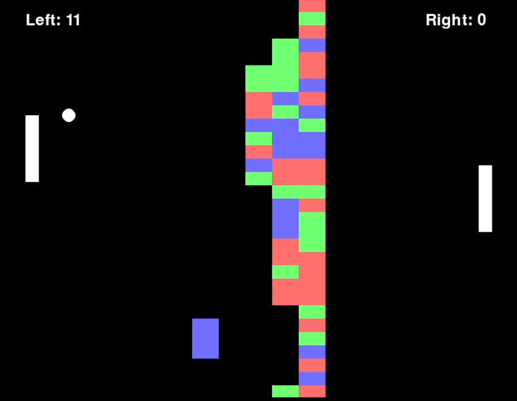

# BreakPongGame

A Pygame game called "Break-Pong," which combines elements of Pong and Breakout. In this game, two players control paddles on opposite sides of the screen, hitting a ball to break a central wall of bricks. Points are scored by breaking bricks and by letting the ball pass the opponent's paddle. The game includes smooth animations, colorful graphics, and particle effects to make it visually appealing

